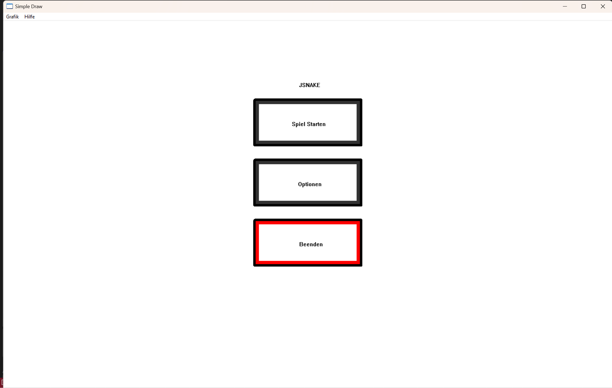
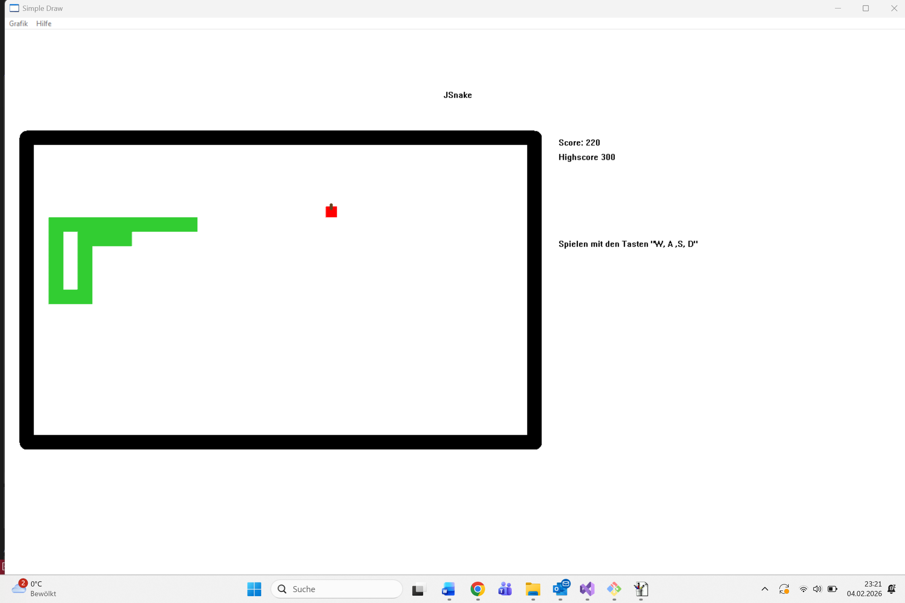
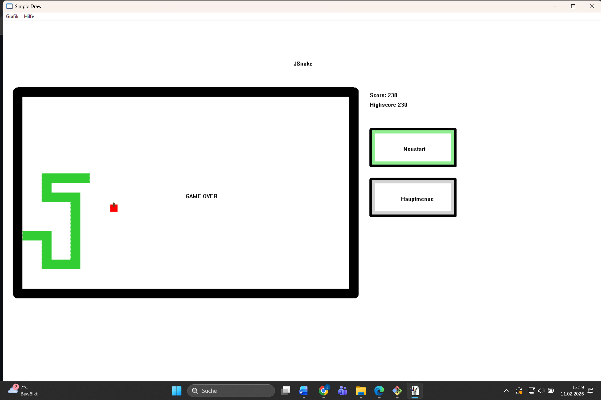

# JSnake

JSnake is a Snake game written in C for Windows, rendered with **Simple Draw (DDE)** 

The project demonstrates a modular architecture with an external DDE-based graphics process and runtime monitoring.

## Features
- Classic Snake gameplay
- Score + persistent highscore
  - Highscore is stored in a small binary file (read/write)
- Game states architecture:
  - Menu, Ready, Running, Game Over, Options
- Options menu:
  - Change the snake color at runtime
- Logging:
  - A log file is created and `stderr` is redirected into it
  - DDE connection messages from Simple Draw as well as custom diagnostics are written to the log
- DDE connection monitoring / recovery:
  - Simple Draw runs as a separate renderer process
  - JSnake detects disconnects and shows a graphical message to the user
  - JSnake can auto-start Simple Draw (retries up to 3 times) and then exits cleanly if it fails

  ## Download

- **Latest Version:** v1.1.0  
- **Platform:** Windows  

👉 https://github.com/jwlf42/JSnake/releases/latest

Requires `Simple DDE Draw.exe` (see build & run section).

## Screenshots

### Main Menu

### Gameplay

### Game Over

## Build & Run (Windows / Visual Studio)

### Requirements
- Visual Studio (C toolchain)
- **Simple DDE Draw (Win32)**

### Run-time setup
- `Simple DDE Draw.exe` must be located in the **same folder** as `JSnake.exe`.
- JSnake will start the renderer automatically (with retries) and will log any connection problems.

### Build steps
1. Download **Simple DDE Draw** (ZIP) from THM and extract it:
   - https://www.thm.de/iem/martin-graefe/tools-fuer-den-einstieg-in-die-programmierung
2. Open the Visual Studio solution (`.sln`).
3. Select **Release** configuration.
4. Build the solution.
5. Copy/ensure `Simple DDE Draw.exe` is in the same directory as the built `JSnake.exe`.

### Notes about Simple Draw integration (important)
The THM ZIP also includes a `simple_draw.c` and `simple_draw.h`.  
**Do not use those files.**
This repository contains the correct integration files that were adjusted to support DDE monitoring and proper DDE handle cleanup (prevents issues after longer runtimes):
- `simple_draw.c`
- `simple_draw.h`

## Project History
Early development milestones created before Git was used are archived in [`legacy_pre_git/`](legacy_pre_git).

## Credits
This project uses **Simple Draw**, created by Prof. Dr. Martin Gräfe (THM), for educational purposes.